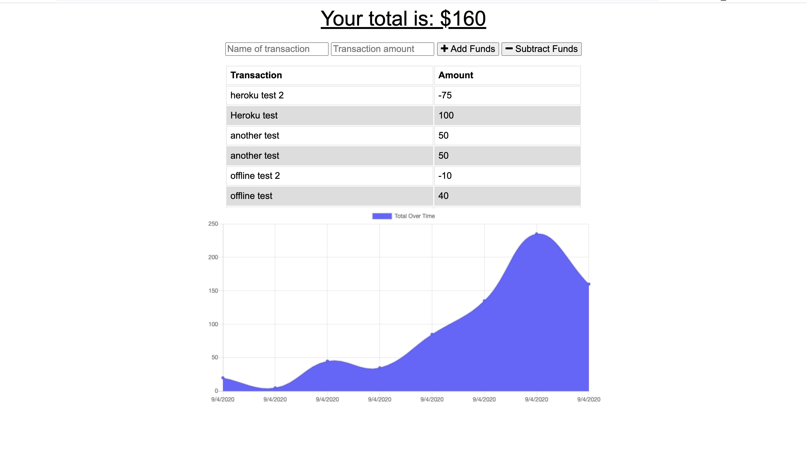

# Budget Tracker
>A simple program to keep a budget.

## Table of contents
* [General info](#general-info)
* [Installation](#installation)
* [Functionality](#functionality)
* [Screenshots](#screenshots)
* [Status](#status)
* [Link](#link)
* [License](#license)
* [Contact](#contact)

## General info
This program will allow you to add and subtract funds for an easy look at money management.

## Installation
Steps required to install project and how to get the development environment running:

- Clone the repo to your own system.
- Run npm install from the command line in the root directory
- Invoke the application with "npm start"

This will connect you to the localhost:3001 where you can test the app.

You may also test the app through the Heroku link listed in the links section.

Additionally, since this is a PWA, supported browsers will allow you to install the program as an App. After loading the page in a browser, you should see a + inside of a circle on the right side of the address bar. Click on this and follow the prompts to install the program as a local App.

## Functionality
This is a very simple program that allows you to add funds and subtract funds, each with giving ther transaction a name and an amount. The entries will be displayed, along with a graph showing you the changes in your budget over time. If you have been to the site before and are unable to connect to the internet, you will still be able to make transactions, and the next time you are connected to the internet your transactions will then be logged to the server.

## Screenshots

## Status
Project is: _complete_ (for now)

## Links
 - Respository Link - https://github.com/JohnNielsen1221/budget-tracker
 - Heroku Link - https://calm-gorge-84926.herokuapp.com/

## License
Permission is hereby granted, free of charge, to any person obtaining a copy of this software and associated documentation files (the "Software"), to deal in the Software without restriction, including without limitation the rights to use, copy, modify, merge, publish, distribute, sublicense, and/or sell copies of the Software, and to permit persons to whom the Software is furnished to do so, subject to the following conditions:

The above copyright notice and this permission notice shall be included in all copies or substantial portions of the Software.

THE SOFTWARE IS PROVIDED "AS IS", WITHOUT WARRANTY OF ANY KIND, EXPRESS OR IMPLIED, INCLUDING BUT NOT LIMITED TO THE WARRANTIES OF MERCHANTABILITY, FITNESS FOR A PARTICULAR PURPOSE AND NONINFRINGEMENT. IN NO EVENT SHALL THE AUTHORS OR COPYRIGHT HOLDERS BE LIABLE FOR ANY CLAIM, DAMAGES OR OTHER LIABILITY, WHETHER IN AN ACTION OF CONTRACT, TORT OR OTHERWISE, ARISING FROM, OUT OF OR IN CONNECTION WITH THE SOFTWARE OR THE USE OR OTHER DEALINGS IN THE SOFTWARE.

## Contact
Created by John Hayes Nielsen - johnhayesnielsen@gmail.com